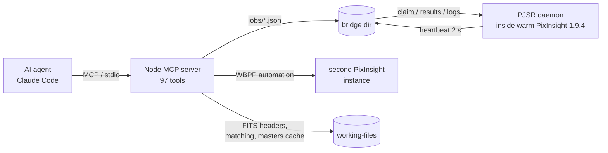

<div align="center">

# pixinsight-mcp

**Give an AI agent full control of PixInsight — from raw subs to a finished image, with eyes.**

Developed by [Iftah Saar](https://iftah.dev) · [iftah.dev](https://iftah.dev)

[](LICENSE)
[](package.json)
[](https://pixinsight.com)
[](https://modelcontextprotocol.io)
[](tests)

<br>


*M31 — 29 × 180 s (87 min), ZWO ASI2600MC Pro · ZWO FF70 · AM5N · ASIAIR. Blink-culled, WBPP-stacked, DBE → SPCC → denoise → MaskedStretch → HDR → star reduction, all driven through this server by Claude; final touch-up in Photoshop.*

</div>

---

## Contents

- [What it does](#what-it-does)
- [How it works](#how-it-works)
- [Quick start](#quick-start)
- [House rules baked in](#house-rules-baked-in)
- [A session, end to end](#a-session-end-to-end)
- [The default processing recipe](#the-default-processing-recipe)
- [Tool catalogue](#tool-catalogue)
- [Calibration matching (CMOS)](#calibration-matching-cmos)
- [Gaia catalog for offline plate solving and SPCC](#gaia-catalog-for-offline-plate-solving-and-spcc)
- [Development](#development)
- [PJSR lessons learned](#pjsr-lessons-learned)
- [Safety](#safety)
- [License](#license)

---

## What it does

PixInsight has no API. This project gives it one — an [MCP](https://modelcontextprotocol.io) server that an AI agent (Claude Code, Claude Desktop, any MCP client) drives with **97 tools**:

| | |
|---|---|
| 🔎 **Inventory** | Parses FITS headers in Node (no PixInsight needed), groups lights/darks/flats/bias by camera, gain, offset, exposure, temperature and target, and explains its calibration matching — CMOS-correct (no bias when darks match). |
| 👁 **Eyes** | Every step can be *looked at*: `render_preview`, `crop_preview`, `compare_previews`, `blink_frames` return JPEGs as MCP images. Statistics, histograms, star FWHM/eccentricity give the numbers. |
| 🧹 **Blink culling** | A contact sheet of every sub with background, star count and gradient metrics; suspects flagged. The agent looks and drops clouds, dew, trails. |
| 🧱 **Stacking** | PixInsight's own **WBPP** (default) in a second instance with exactly the matched calibration groups — or a native chain: calibration → CFA cosmetic correction → debayer → SubframeSelector → StarAlignment → LocalNormalization → ImageIntegration → DrizzleIntegration. Async jobs with live per-frame progress. |
| 🎨 **Post-processing** | DBE with automatic samples, BN, plate solving (offline Gaia), SPCC, denoise, MaskedStretch, HDR, masked local contrast, curves, hue-weighted saturation, star reduction, masks, rotate/crop, `apply_process` for anything else. Every destructive step checkpoints first. |
| 📓 **Provenance** | `save_project` writes the XISF with embedded history, a manifest and a human-readable `PROCESSING.md` of every step and parameter. |
| 🧽 **Housekeeping** | Working files live next to the object (`<target>/working-files`); intermediates are deleted as soon as the next stage succeeds. No 50 GB surprises. |

---

## How it works



- One **long-lived PixInsight** runs `pjsr/daemon.js` (`#engine v8`) and polls a job directory. The filesystem is the transport: boring, debuggable, survives crashes.
- Image windows stay open between calls; tools address them by view id.
- Long operations return a `job_id`; the console log is streamed to disk and parsed into `current/total` progress. `job_wait` blocks up to five minutes; `PI_BUSY` protects the single-threaded daemon, also across server processes.
- Modal dialogs are suppressed (`noGUIMessages`) and a silent console is reported as a hint, so the agent never hangs on a hidden message box.

---

## Quick start

**Requirements:** Windows (tested on 11), PixInsight 1.9.4, Node ≥ 20. Optional: BlurXTerminator / NoiseXTerminator / StarXTerminator (detected, with native fallbacks).

```bash
git clone https://github.com/iftahs/pixinsight-mcp
cd pixinsight-mcp
npm install
npm run build
```

Create `pixinsight-mcp.config.json` (or `~/.pixinsight-mcp.json`, or `PIMCP_CONFIG=<path>`):

```json
{
  "piExe": "C:/Program Files/PixInsight/bin/PixInsight.exe",
  "dataRoot": "C:/Users/me/Astro/Astronomy",
  "requireFlats": true,
  "rig": { "pixelSizeUm": 3.76, "focalLengthMm": 490, "cameraGainEPerAdu": 0.25, "bayerPattern": "RGGB" }
}
```

Register with Claude Code (`.mcp.json`):

```json
{
  "mcpServers": {
    "pixinsight": {
      "command": "node",
      "args": ["<repo>/dist/index.js"],
      "env": { "PIMCP_CONFIG": "<repo>/pixinsight-mcp.config.json" }
    }
  }
}
```

Install `skill/SKILL.md` as a Claude skill — it is the agent-facing workflow guide (also served as the MCP resource `pi://skill`). Then just ask: *"process the M31 folder"*.

<details>
<summary><b>All configuration keys</b></summary>

| Key | Default | Meaning |
|---|---|---|
| `piExe` | PixInsight default path | Executable |
| `dataRoot` | — | Raw data. **Never written to.** |
| `workLayout` | `"target"` | Working files at `<object>/working-files` (parent of a `Lights/` folder); `"workdir"` for a central dir |
| `stackingEngine` | `"wbpp"` | `"native"` for the tool chain |
| `wbppParams` | `{}` | Extra WBPP automation parameters |
| `confirmOnWarnings` | `true` | Refuse to stack on mismatched/missing calibration until acknowledged |
| `requireFlats` | `true` | Refuse calibration without a master flat unless forced |
| `keepIntermediates` | `false` | Keep calibrated/registered files after each stage |
| `excludeDirNames` | working-files, … | Folders skipped by `scan_frames` |
| `includeAdpScripts` | `true` | Compile ImageSolver/AnnotateImage into the daemon |
| `allowRawScripts` | `true` | Enable `pi_run_pjsr` |
| `autoLaunch` | `true` | Start PixInsight on demand |
| `tolerances` | 0.5 % / 2 °C / 5 °C / 14 d / 200 steps | Matching tolerances |
| `rig` | ASI2600MC + FF70 | Pixel size, focal length, e⁻/ADU |

Environment overrides: `PIMCP_PI_EXE`, `PIMCP_DATA_ROOT`, `PIMCP_WORKDIR`, `PIMCP_REQUIRE_FLATS`, `PIMCP_ALLOW_RAW_SCRIPTS`, `PIMCP_AUTO_LAUNCH`.

</details>

---

## House rules baked in

These came out of real sessions and are enforced in code, not just documented:

| Rule | Where |
|---|---|
| Working files next to the object, never in the raw folders, intermediates deleted as stages complete | `workLayout`, `keepIntermediates`, `cleanup_working_files` |
| **Look before stacking**: blink contact sheet → drop bad subs | `blink_frames`, `exclude_frames` |
| **Stop rule**: mismatched or missing calibration (dark temperature > 2 °C, dark scaling, no flats) → refuse until the user has been told and agrees | `match_calibration.needs_confirmation`, `pipeline_run` → `NEEDS_CONFIRMATION` |
| WBPP is the stacking engine unless asked otherwise; exact matched groups; `platesolve=false` | `stackingEngine` |
| CMOS calibration: matched darks → **dark + flat only**, no bias, no dark optimisation | `matching/match.ts` |
| Every destructive step checkpoints; `restore_checkpoint`/`undo` roll back | `pjsr/ops/postprocess.js` |
| A `PROCESSING.md` and a 16-bit TIFF finish every image | `save_project`, `write_processing_log` |

---

## A session, end to end

```
pi_status                              daemon up, modules, Gaia
scan_frames                            light_01 M 31 30×180 s g100 · dark_05 180 s g100 0 °C · …
match_calibration light_01             dark_05 (Δ 0.0 °C, ok) · no flats → needs_confirmation → ask user
blink_frames light_01                  contact sheet: #1 hazy (bg +21 %, stars −50 %)
exclude_frames [1]
pipeline_run light_01 (acknowledge)    WBPP in M 31/working-files/wbpp → master_light view
gradient_correction DBE → background_neutralize → plate_solve → color_calibrate SPCC → denoise
stretch masked → hdr_compress → range_mask + local_contrast → scnr → saturation → curves
reduce_stars → rotate 180
save_project → save_image tif 16-bit → cleanup_working_files
```

<div align="center">


*1:1 detail: dust lanes and the HDR-compressed core.*
</div>

---

## The default processing recipe

The recipe that produced the image above lives in `skill/SKILL.md` and is what the agent follows unless told otherwise:

1. `gradient_correction { method: "DBE" }` — DynamicBackgroundExtraction with automatically placed background samples (stars and object rejected)
2. `background_neutralize` → `plate_solve` → `color_calibrate { method: "SPCC" }` against the local Gaia DR3/SP database
3. `denoise { strength: 0.3 }` (NoiseXTerminator if present, else MLT), verified at 1:1
4. `stretch { method: "masked", target_background: 0.15 }` — MaskedStretch keeps star cores small
5. `hdr_compress` → `local_contrast` through a `range_mask` of the object only
6. `scnr` → hue-weighted `saturation` (blue/cyan for galaxies, red/magenta for emission nebulae) → `curves`
7. `reduce_stars` (StarMask-protected morphological erosion) → `rotate` / `crop` for framing
8. `save_project` (+ `PROCESSING.md`) → `save_image { format: "tif", bit_depth: 16 }` → cleanup

---

## Tool catalogue

<details>
<summary><b>Session & jobs</b></summary>

`pi_status` `pi_capabilities` `pi_start_session` `pi_list_sessions` `pi_use_session` `pi_end_session` `pi_console_log` `pi_run_pjsr` `pi_restart` `pi_stop` · `job_status` `job_wait` `job_log` `job_cancel` `list_jobs`
</details>

<details>
<summary><b>Inventory & review (Node only)</b></summary>

`scan_frames` `group_files` `fits_header` `match_calibration` `list_masters` · `blink_frames` `exclude_frames`
</details>

<details>
<summary><b>Calibration & stacking</b></summary>

`build_master_bias` `build_master_dark` `build_master_flat` `calibrate_lights` `cosmetic_correction` `debayer` · `measure_subframes` `select_subframes` `register` `local_normalization` `integrate` `drizzle_integrate` `fast_integrate` · `pipeline_run` `pipeline_status` `wbpp_run` `wbpp_status`
</details>

<details>
<summary><b>Inspection</b></summary>

`list_windows` `open_image` `close_window` `duplicate_window` `image_statistics` `histogram` `image_keywords` `render_preview` `crop_preview` `compare_previews` `measure_stars` `set_screen_stretch` `save_image` `checkpoint` `restore_checkpoint` `undo` `list_checkpoints`
</details>

<details>
<summary><b>Post-processing</b></summary>

`apply_process` `process_params` `gradient_correction` `plate_solve` `annotate` `color_calibrate` `background_neutralize` `scnr` `deconvolve` `denoise` `remove_stars` `stretch` `curves` `saturation` `reduce_stars` `rotate` `resample` `crop` `auto_crop` `pixel_math` `linear_fit` `sharpen` `hdr_compress` `local_contrast` `combine_stars` `extract_channels` `convert_to_gray` `invert`
</details>

<details>
<summary><b>Masks, catalogs, project</b></summary>

`star_mask` `range_mask` `pixelmath_mask` `apply_mask` `mask_info` `binarize` `morphology` `blur` · `configure_gaia` `gaia_info` · `save_project` `write_processing_log` `cleanup_working_files`
</details>

Resources: `pi://session/current`, `pi://previews/{name}`, `pi://jobs/{id}/log`, `pi://masters`, `pi://skill`. Prompts: `process-session`, `inspect-frame`.

---

## Calibration matching (CMOS)

| Pair | Exact | Tolerance |
|---|---|---|
| light ↔ dark | INSTRUME, GAIN, OFFSET, binning | EXPTIME ± 0.5 %; CCD-TEMP graded **ok** ≤ 2 °C · **acceptable** ≤ 5 °C · **poor** beyond (nearest set chosen, flagged for confirmation) |
| light ↔ flat | INSTRUME, binning, FILTER | warn if DATE-OBS > 14 d or FOCUSPOS > 200 steps apart |
| flat ↔ flat-dark | INSTRUME, GAIN, OFFSET, binning | EXPTIME ± 0.5 % |
| any ↔ bias | INSTRUME, GAIN, OFFSET, binning | — |

Decision tree: matched darks → **dark + flat only** (bias is inside the dark; `masterBias=off`, `optimizeDarks=off`). Exposure mismatch + `allow_dark_scaling` → bias + optimisation, flagged second-best. Flats always calibrated with a flat-dark (preferred) or bias, never the light dark. No darks → bias + flat with mandatory cosmetic auto-detect. Light groups never split on temperature; drift is reported instead. Masters are content-addressed and reused.

---

## Gaia catalog for offline plate solving and SPCC

Download the **Gaia DR3/SP small set** (4 `.xpsd` files, ~11 GB) from [pixinsight.com/dist](https://pixinsight.com/dist/) and run `configure_gaia { dir }`. `plate_solve` then uses `GaiaDR3SP_XPSD` locally — ImageSolver's automatic mode only probes DR3/EDR3/DR2 and otherwise falls back to VizieR, which fails on machines with a broken TLS chain. `gaia_info` tells you what is configured.

---

## Development

```bash
npm test                                      # 46 unit tests, no PixInsight
npm run fixtures                              # synthetic RGGB fixtures under tests/fixtures/data
PI_INTEGRATION=1 npm run test:integration     # 5 end-to-end tests incl. chaos kill (~2 min)
npx tsx scripts/smoke.ts pi_status '{"launch":true}'
npx tsx scripts/pipeline-smoke.ts '{"light_group_id":"light_01","max_frames":4,"force":true}'
```

`pjsr/reference/*.txt` holds the default `toSource()` of every wrapped process as dumped from PixInsight 1.9.4 — the source of truth for parameter names (`pjsr/reference/dump-process-params.js` regenerates it). After editing anything under `pjsr/`, call `pi_restart`.

---

## PJSR lessons learned

<details>
<summary>Things that cost a debugging round each</summary>

- `#engine v8` is required for modern syntax and to `#include` PixInsight's ImageSolver library. Under V8: process enums are statics (`ImageIntegration.Average`), 64-bit counters are `BigInt`, `View.viewById` returns `null`, `Histogram` is `new Histogram(bins)` + `generate(image)`, `StarDetector` is native (including `pjsr/StarDetector.jsh` shadows it and breaks ImageSolver).
- The preprocessor treats `/*` inside a `//` comment as a block-comment start, and substitutes macro names even after a dot (`PIMCP.const.ColorSpace_Gray` → `PIMCP.const.0`).
- `SubframeSelector.measurements` is read-only and weighting expressions evaluate to 0 from scripts → weights are computed in Node and stamped as `SSWEIGHT`.
- `DynamicBackgroundExtraction` executes from its `data` table (normalised coordinates); `samples` is the GUI table (`symmetries 0, axialCount 3..24, isFixed numeric`).
- Two daemons on one bridge make jobs alternate between instances; the daemon now exits when another heartbeat is fresh.
- Modal dialogs block the daemon silently; every process runs with `noGUIMessages = true`.
- WBPP automation: `outputDirectory=` (not `outputDir`), `platesolve=false` to avoid its interactive solver.
- `Image.resample(w, h)` takes scale factors, not sizes.
</details>

---

## Safety

Outputs are refused under `dataRoot` or any scanned root except the object's `working-files`; nothing is overwritten (`save_image` needs `overwrite:true`, masters are content-addressed); inspection works on clones; fewer than 3 frames are refused without `force`; destructive tools checkpoint first; one PixInsight job at a time; mismatched calibration stops the pipeline until acknowledged.

## License

MIT © 2026 [Iftah Saar](https://iftah.dev)
